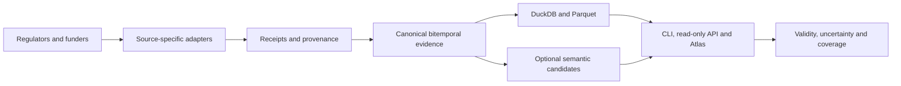

# Global Medicines Atlas

[](https://github.com/edithatogo/global-medicines-atlas/actions/workflows/test-goblin.yml)
[](https://github.com/edithatogo/global-medicines-atlas/actions/workflows/security-context.yml)
[](https://app.codecov.io/gh/edithatogo/global-medicines-atlas)
[](https://www.python.org/downloads/)
[](LICENSE)

Global Medicines Atlas is an evidence-first system for comparing medicine
regulatory approval, public funding, formulary status, and terminology across
jurisdictions.

The project keeps those dimensions independent. A terminology match, product
listing, price, or formulary entry is never treated as regulatory approval
without source-specific evidence.

> **Maturity:** the software and representative fixtures are qualified; live
> global source coverage, public datasets, a hosted service, and a stable final
> release are not yet claimed.

## Capability status

| Capability | Current evidence |
|---|---|
| Python 3.14 package, CLI, API and server-rendered Atlas | Software-qualified |
| NZULM/NZMT, Drugs@FDA, PBS, EMA and initial global adapters | Representative fixtures |
| Property, metamorphic, contract, deterministic simulation and mutation testing | Blocking CI |
| Live regulatory and funding coverage | External qualification required |
| Public dataset, hosted API and hosted Atlas | Not yet published |
| Release candidate | Qualified; signing and publication staged separately |

## Current scope

- New Zealand NZULM/NZMT and FHIR adapter boundary.
- Tiered offline-first RxNorm/RxNav-compatible terminology resolution.
- Governed global API and downloadable-source catalog.
- Initial country contracts for New Zealand, Australia, the United States,
  United Kingdom, Canada, Japan, and the European Union.
- Fixture-driven Drugs@FDA bulk projection.

Detailed requirements, design, plans, and evidence are under
[`conductor/`](conductor/index.md). GitHub issues mirror each active Conductor
track in the
[Global Medicines Atlas Conductor Project](https://github.com/users/edithatogo/projects/35).

## Maintainer workflow

This is a single-accountable-maintainer repository with automated evidence
rather than invented reviewer roles. Start with [`AGENTS.md`](AGENTS.md) and
the machine-readable [context manifest](.context/project.toml). Pull requests
run the complete Python 3.14 harness, locked Mojo canary, context-drift checks,
CodeQL, Zizmor, dependency audit, and SBOM generation. Licensing, credentials,
public release, external publication, compatibility archival, and
consequential interpretation remain explicit human gates.

Codecov is active for this public repository. The project gate is 91%, the
patch gate is strictly above 90%, and each Test-Goblin lane uploads an
independently visible flag through GitHub OIDC. See the
[testing and Codecov contract](docs/testing/test-goblin.md#coverage-and-codecov)
for the fail-closed policy.

Relevant maintainer-owned GitHub and Hugging Face resources are governed by the
[ecosystem reuse registry](docs/ECOSYSTEM_REUSE.md), which runs in the routine
harness to prevent parallel implementations and untracked copying.

The evidence-gated [v0.1-to-v1.0 roadmap](conductor/roadmap.md) maps product
features and maturity levels to Conductor tracks and the native GitHub
[roadmap issue hierarchy](https://github.com/edithatogo/global-medicines-atlas/issues/44).

## Use the atlas

### Five-minute local start

The authoritative runtime is CPython 3.14. From a source checkout:

```console
uv sync --python 3.14.6 --locked --no-dev
uv run global-medicines-atlas --help
uv run global-medicines-atlas comparison --help
uv run pytest -q tests/test_smoke.py
```

Queries require an explicit governed DuckDB database and a deployment-owned
cursor secret; the repository never substitutes test fixtures for production
data. The optional LanceDB-backed semantic layer is installed with
`--extra semantic`. See the user guide for PowerShell commands and the current
API/Atlas application-factory boundary.

Start with the [task-oriented user guide](docs/user-guide.md) to:

- install the core package or opt into semantic retrieval;
- exercise the CLI, API contract, and server-rendered Atlas;
- interpret regulatory, funding, uncertainty, and comparison-validity results;
- reproduce the repository locally or rehearse recovery; and
- report support, security, or medicine-data integrity issues.

The repository currently provides source-checkout and built-artifact workflows,
not a published package, hosted API, or hosted Atlas service. Commands requiring
a canonical DuckDB database do not silently substitute the repository's
representative test fixtures for production medicine data.

## Architecture



Regulatory approval, public funding, formulary status, terminology similarity,
and comparison validity remain separate throughout this flow.

## Interpreting a comparison

For example, a medicine may have a current regulatory approval from Medsafe
while having no confirmed PHARMAC funding assertion for the same indication
and observation date. The Atlas reports those as two evidence states. It does
not convert missing funding evidence into “not funded,” and it does not infer
therapeutic equivalence from an RxNorm or lexical match.

## What this project does not claim

- It does not provide medical advice or prescribing recommendations.
- A cross-jurisdiction match does not establish therapeutic equivalence,
  substitutability, interchangeability, or equal benefit.
- Catalogue coverage and representative fixtures do not establish complete or
  current global coverage.
- Repository visibility does not grant rights in third-party medicine data.
- A green workflow is not evidence that an external dataset, DOI, service, or
  preregistration has been published.

## Data boundaries

The repository does not publish the local NZULM release, restricted
terminologies, credentials, or derived private research outputs. Source
catalog entries describe access surfaces; they do not claim complete ingestion
or global coverage. Read the [software and source-data rights](docs/data-sources/SOURCE_RIGHTS.md)
and [stable-v1 qualification limitations](docs/qualification/stable-v1-contract.md)
before reusing code, source material, or derived outputs.

## Project navigation

- [User guide](docs/user-guide.md)
- [OpenAPI compatibility contract](contracts/openapi-readonly-v1.json)
- [Global source census](docs/data-sources/global-source-census.md)
- [Coverage qualification](docs/qualification/stable-v1-measured-coverage.md)
- [Academic protocol](docs/research/academic-protocol.md)
- [Security policy](SECURITY.md)
- [Contributing](CONTRIBUTING.md)
- [Citation metadata](CITATION.cff)
- [Software licence](LICENSE) and [derived-data licence boundary](DATA_LICENSE.md)
- [Versioned roadmap](conductor/roadmap.md)
