# System Design

## Architectural Position

The local workspace is the canonical global monorepository. `nzmedicines` becomes a preserved upstream history, NZULM/NZMT FHIR adapter, and fixture source. Portable canonical data remains separate from source-native FHIR projections and derived search indexes.

```mermaid
flowchart LR
    subgraph Sources["Jurisdiction source systems"]
        NZ["NZULM/NZMT, Medsafe, PHARMAC, NZF"]
        AU["TGA and PBS"]
        US["FDA, CMS and RxNorm/RxNav"]
        GL["Additional regulators and funders"]
    end

    subgraph Acquisition["Governed acquisition"]
        REG["Source and licence registry"]
        ADP["Versioned source adapters"]
        SNAP["Immutable source snapshots"]
    end

    subgraph Canonical["Canonical evidence core"]
        MED["Medicine and product identities"]
        ASSERT["Regulatory and funding assertions"]
        MAP["Cross-jurisdiction mappings"]
        PROV["Provenance, coverage and uncertainty"]
    end

    subgraph Engines["Execution and storage"]
        MOJO["Mojo kernels"]
        PY["Python 3.14 reference fallback"]
        POLARS["Polars and Arrow"]
        PARQUET["Parquet"]
        DUCK["DuckDB"]
        LANCE["LanceDB derived index"]
        LEX["Optional Tantivy lexical index"]
    end

    subgraph Products["Reviewed outputs"]
        CLI["CLI and read-only API"]
        ATLAS["Global comparison atlas"]
        HF["Hugging Face dataset and Space"]
        RELEASE["Signed release packages"]
    end

    Sources --> REG
    REG --> ADP
    ADP --> SNAP
    SNAP --> MED
    SNAP --> ASSERT
    MED --> MAP
    ASSERT --> PROV
    MAP --> PROV
    MED --> POLARS
    ASSERT --> POLARS
    MOJO <--> PY
    MOJO --> POLARS
    PY --> POLARS
    POLARS --> PARQUET
    PARQUET --> DUCK
    PARQUET --> LANCE
    PARQUET --> LEX
    DUCK --> CLI
    LANCE --> CLI
    LEX --> CLI
    CLI --> ATLAS
    PROV --> HF
    PROV --> RELEASE
```

## NZ Adapter and Migration Boundary

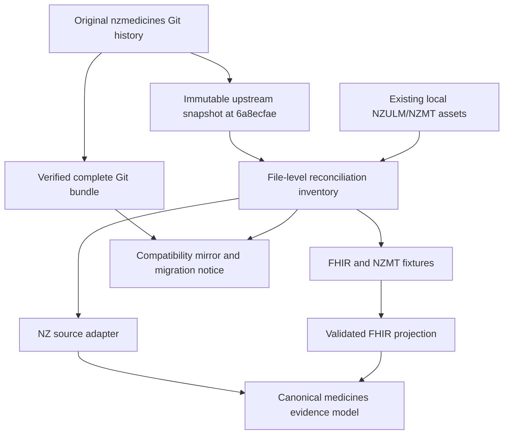

The upstream snapshot is evidence, not the editable implementation surface. Adapted code and schemas live in first-party package paths; retained upstream resources remain traceable to their original commit and file.

## Medicine Evidence Model

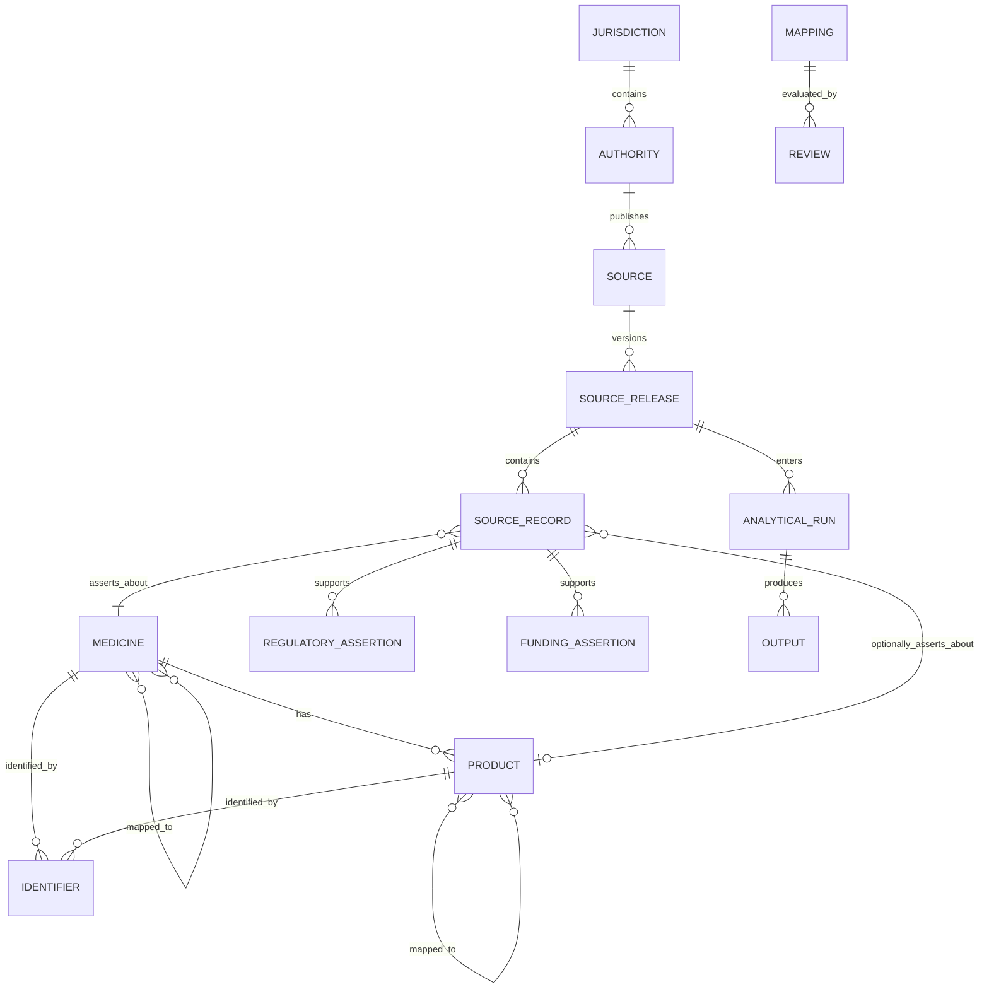

## RxNav-in-a-Box Boundary

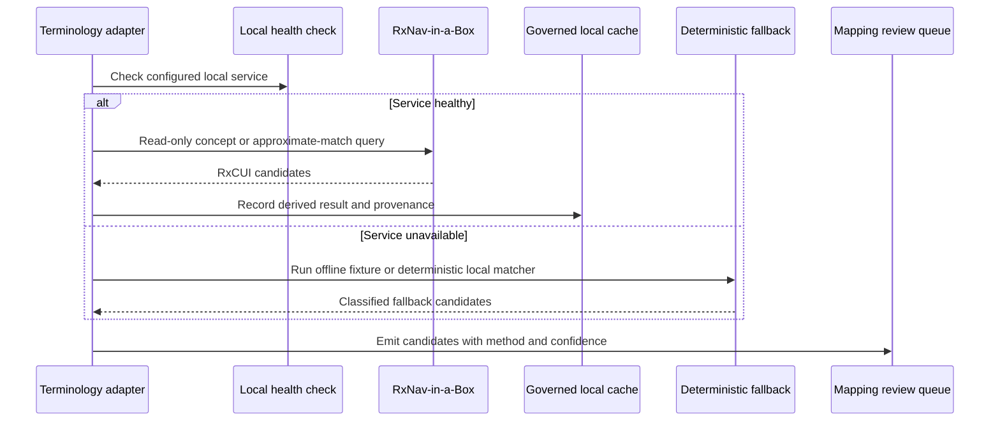

## Work Traceability

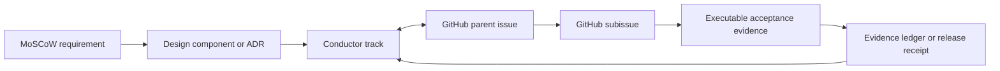

## Deployment Boundary

- Windows development uses Python directly and Mojo through WSL.
- Linux CI is authoritative for Mojo.
- DuckDB, LanceDB, and optional lexical indexes are regenerable from portable governed artifacts.
- Public datasets contain only reviewed redistributable material.
- Credentials, restricted terminology payloads, and local source caches remain outside Git.

## Bronze Internal Strata and Medallion Boundary

Bronze comprises three internal Bronze strata, not additional medallion levels.
**B0 Source Index** is the versioned index of agencies, datasets, APIs, and
source surfaces; indexing does not imply acquisition, coverage, qualification,
or currency. **B1 Acquisition Metadata** is the append-only record of
acquisition events, receipts, temporal identity, rights state, reuse decisions,
HTTP or other retrieval evidence, admission state, and provenance
relationships. **B2 Raw Evidence** is immutable source-native bytes, or a
rights-constrained immutable reference when bytes cannot lawfully be retained.

Source-faithful Parquet, archive-member manifests, OpenLineage, Iceberg,
DuckDB, and other query/catalogue objects are rebuildable Bronze projections
over B1/B2, not a fourth evidentiary source of truth. Projections may aid
inspection, recovery, lineage, or querying, but cannot replace the B1 event
history or B2 evidence identity. Silver remains source-faithful typed or
harmonised structures; Gold remains cross-jurisdiction matched evidence;
Platinum remains products and presentation.

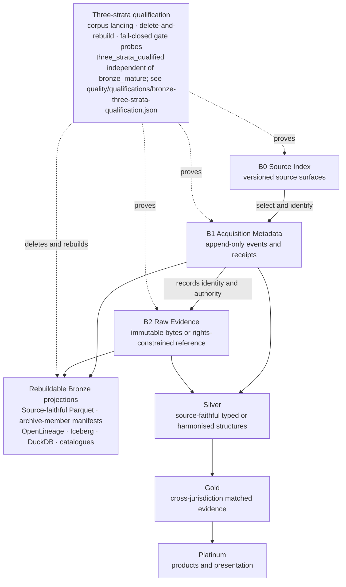

Within B1, authority flows only from native append-only records. The portable
manifest is a deterministic query view; OpenLineage and table catalogues are
interoperability projections over that view and the same native evidence.

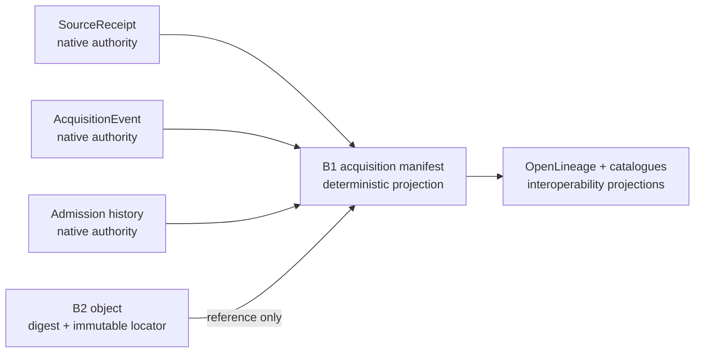

## Single-Maintainer Context Control Plane

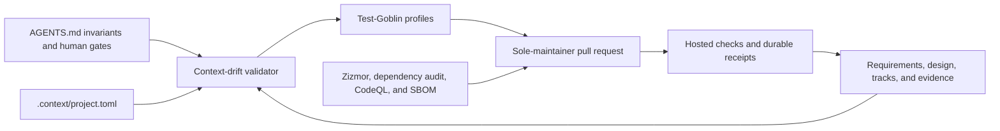

Automation supplies independent evidence, not a fictional independent
reviewer. Credentials, licensing, publication, release, archival, and
consequential-interpretation decisions remain explicit maintainer gates.

## Version and Maturity Control Plane

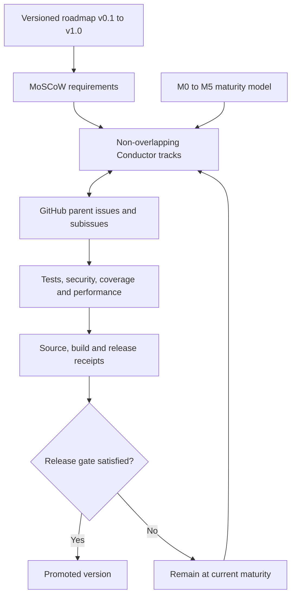

## Product Delivery and Hardening

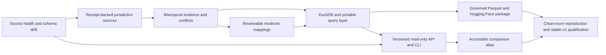

## Source Information and Adapter Capability Contract

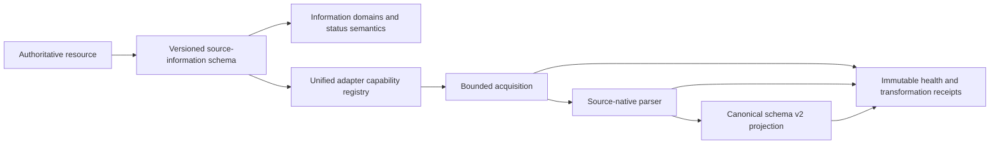

Each catalog entry labels the entities and information it actually contains.
Regulatory status, funding eligibility, prices, terminology relationships and
safety information remain distinct domains. Capability declarations distinguish
synthetic fixtures from live acquisition and production qualification.

## Canonical Discovery and Consumer Boundary

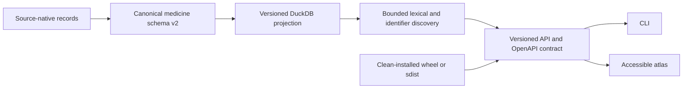

Discovery returns native and canonical identifiers, match method, provenance
and jurisdiction scope. SQL keyset pagination and database schema metadata keep
large queries bounded and migration-aware.

## Comparison Validity Boundary

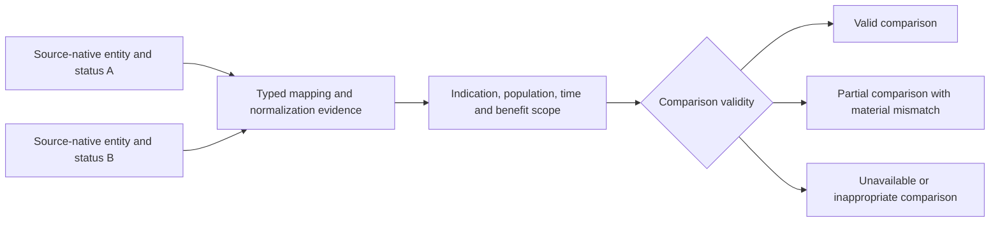

Comparison validity is an explicit output, not an inference from name or
terminology similarity. The system retains source-native legal and funding
meanings and must not imply therapeutic equivalence, substitutability or equal
benefit when entity, indication, population, temporal or benefit-design scopes
do not support that conclusion.

## Governed Research and Dataset Identity

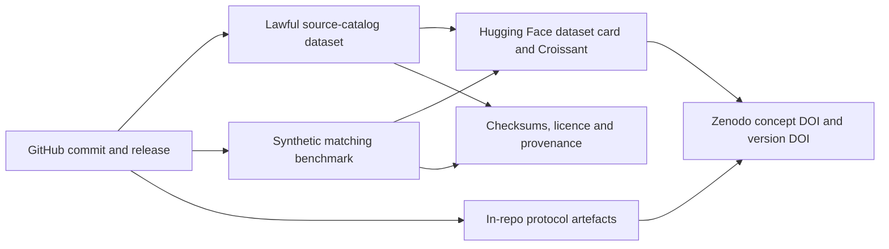

The source catalog and lawful synthetic benchmark are separate products with
separate licences and identifiers. Rights-restricted medicine payloads remain
outside public publication packages. Creating external records or publishing a
release remains an explicit maintainer gate. OSF is deprecated and is not a
live publication identity.

The Phase 1 research contract is the machine-readable
`research/protocol/academic-protocol-v1.json`, validated by
`schemas/academic-protocol-v1.json` and rendered offline to
`docs/research/academic-protocol.md`. It binds the governed source catalog and
M-090 comparison-validity vocabulary to the protocol/methods work in GitHub
[#67](https://github.com/edithatogo/global-medicines-atlas/issues/67).

The historical Phase 3 OSF-format rehearsal remains in
`research/preregistration/` as a superseded offline artefact. It is not a live
submission path. The persistent public identity is the in-repo protocol plus
Zenodo DOI `10.5281/zenodo.21734811`.

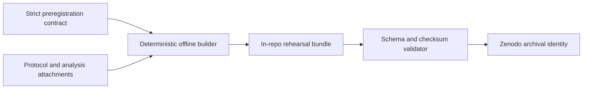

## Untrusted Acquisition and Failure Containment

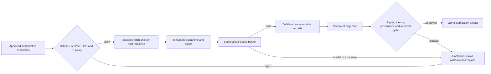

Acquired bytes are untrusted even when an authority is official. Logs retain
source IDs, digests and bounded outcomes but redact credentials, query strings
and source payloads. Compromise recovery covers upstream data, signing
provenance, credentials and already-published datasets. Bronze inspects
truncated bodies, hostile archives, media mismatches, poison identity fields,
replays, and checksum failures without rewriting landed bytes; admission
quarantines processing and keeps the payload as forensic evidence.

## Medallion Datahouse

The medicines comparison product is implemented as a four-layer medallion
datahouse. Bronze is the current completion horizon. Silver, gold, and platinum
are sketched so later tracks have a stable boundary; they are not implemented
by the bronze-completion track.

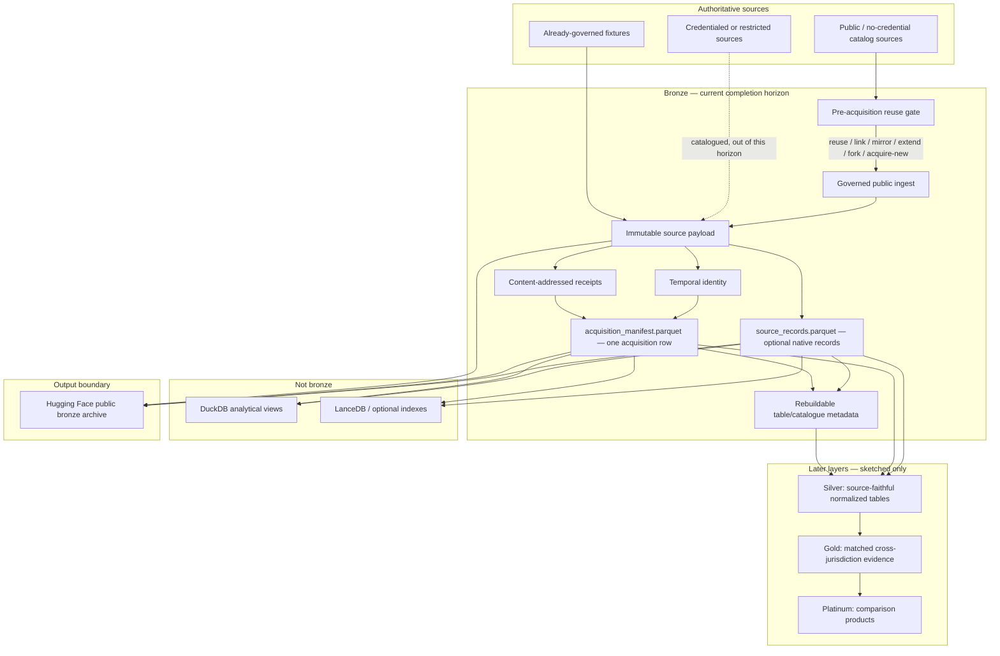

Hugging Face is an archive and publication boundary for reviewed public bronze
outputs. It is not an ingest origin and not the source of truth. The immutable
source payload and its content-addressed receipt are evidentiary truth;
source-faithful Parquet is the portable analytical representation;
table/catalogue layers are rebuildable metadata over those artefacts. The
sibling Hugging Face archival track owns remote publication mechanics; this
design consumes that boundary.

### Bronze landing

Bronze landing preserves the bytes a source published together with a
content-addressed receipt. That payload-and-receipt pair is evidentiary truth.
Source-faithful Parquet is produced alongside it as two explicit analytical
products: mandatory `acquisition_manifest.parquet`, with one row per
acquisition, and optional adapter-specific `source_records.parquet`, with one
row per source-native record. The latter preserves native names and types where
feasible and carries record, acquisition, content, and schema-fingerprint
linkage without cross-country semantic normalization. Binary documents remain
immutable payloads; extracted text, layout, tables, and chunks are separate
derived datasets. Regulatory, funding, formulary, and terminology land in
independent partitions or tables. Missing coverage is recorded as not covered,
never as unapproved or unfunded. Canonical medicine and product normalization
remains a Silver responsibility.

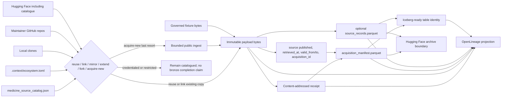

### Pre-acquisition reuse gate

Before any download, including Drugs@FDA, Conductor and acquisition code search
local clones, maintainer GitHub repositories, Hugging Face (including
`edithatogo/global-medicines-atlas-catalogue` at the pinned catalogue
revision), and the source registry. They then choose exactly one of
**reuse | link | mirror | extend | fork | acquire-new**. The choice is recorded
on the receipt, in OpenLineage facets, and in track evidence. acquire-new is
last resort when no payload copy exists. Acquisition without this gate fails.
This gate exists to stop independent repositories accumulating copies of the
same public data. It reuses `docs/ECOSYSTEM_REUSE.md` and
`.context/ecosystem.toml` rather than a parallel registry.

### Temporal identity

Every acquisition receipt distinguishes, as independent fields:

1. source published / effective time (source-native; missing stays missing)
2. retrieved_at (when we fetched)
3. valid_from / valid_to only where the source supplied validity
4. immutable acquisition/version ID (content-addressed; unchanged by re-parse)

Substituting retrieved_at for published time is forbidden. OpenLineage carries
these as facets without replacing native receipts.

Current bronze-completion scope is first-cohort and global catalog sources whose
authentication is none and whose access is not a licensed feed, plus already
governed fixtures (Medsafe, PHARMAC, ARTG, PBS, DPD/NOC, MHRA/NICE, EMA/Union
Register, PMDA/NHI, Drugs@FDA, CMS Part D, and related synthetic fixtures).
Credentialed catalog entries remain out of this horizon, including NZULM bulk,
NZHTS FHIR, AMT RF2, PBS embargo, dm+d/TRUD, EMA PMS, and SPOR. RxNorm/UMLS
source payloads remain fixture-only because restricted terminology bytes are
not public bronze.

Source landing is driven by `medicine_source_catalog.json`, not a handwritten
module per source. `source_landing_factory.py` maps catalogue metadata into six
standard acquisition families and generates the complete machine-readable
work queue plus its schema and Conductor projection. The queue assigns exactly
one fail-closed disposition to each source and carries reusable instructions,
endpoint, formats, pagination shape, evidence scope, next action, and priority.
Exceptional failure, reuse, or manual evidence lives in a sparse versioned
override file. These are acquisition configurations: the existing reuse,
rights, credential, untrusted-byte admission, and content-addressed receipt
gates remain authoritative, and no Silver normalization is generated.

Bronze table identity already includes jurisdiction and source identifier, so
those constants are not repeated as physical partition keys. Small tables are
unpartitioned. A configured large recurring product is partitioned by
source-release month when the source supplies a temporal field, otherwise by
acquisition month; high-volume record identifiers may additionally use a
bounded bucket transform. Mutable rights, admission, and review state are
never physical partitions. Each landed file carries source-native identifiers,
retrieval and effective dates, receipt digest, uncertainty, and an explicit
rights expression. The same acquisition carries an independent sensitivity
classification: intrinsic sensitivity, possible personal data, and
publication disposition are never inferred from licensing rights.

Authoritative payload persistence is storage-neutral. Development uses a
content-addressed local filesystem. Durable operation writes the same content
key to a versioned or Object-Locked primary object store and at least one
geographically and administratively independent replica, then records provider
version identities in an append-only storage receipt. Landing uses a local
materialization for inspection and source parsing, while the acquisition
manifest and OpenLineage payload dataset retain the authoritative object URI.
Periodic checksum inventories read every physical copy; durable restore
rehearsals read the policy-matching independent replica into an empty target,
hash the bytes, and compare measured
elapsed time with the declared RTO. A durable policy is invalid without an
explicit RPO, RTO, inventory cadence, and rehearsal cadence.
Python 3.14 is the complete fallback path. DuckDB and LanceDB may read bronze
Parquet; they do not store bronze evidentiary truth. Iceberg REST registration
is optional and must not be imported by Python 3.14 core. Iceberg-ready
metadata records namespace `bronze`, explicit temporal/bucket transforms when
scale evidence activates them, append-only schema evolution, and snapshot
aliases bound to `acquisition_id`. Iceberg metadata is rebuildable catalogue
state; payload bytes and receipts remain evidentiary truth.

### Lineage and identity graph

Native receipts remain authoritative. OpenLineage is a projection. The source
payload, source-faithful Parquet, and optional Iceberg-ready catalogue are
three datasets. ColumnLineage records Parquet as derived from payload bytes.
Symlinks record the catalogue as an alternative identity of Parquet, never of
the payload. Acquisition identity, clocks, reuse disposition, rights, and
content digests appear as facets.

Acquisition and transformation are distinct OpenLineage runs with deterministic
UUIDs over their native append-only IDs; the standard Parent Run facet links
transformation back to acquisition. Standard Dataset Type facets classify
source, payload, Parquet, and catalogue datasets; the standard Catalog facet
describes the optional Iceberg catalogue; and the payload transformation input
carries standard Data Quality Assertions derived from durable admission and
integrity results. GMA-only facets use `gma_`-prefixed keys and committed JSON
Schemas under `schemas/openlineage/`, with raw GitHub schema URLs pinned to the
commit containing those schemas rather than `blob/main` or another branch.

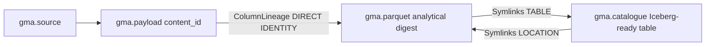

### Later layers (sketch only)

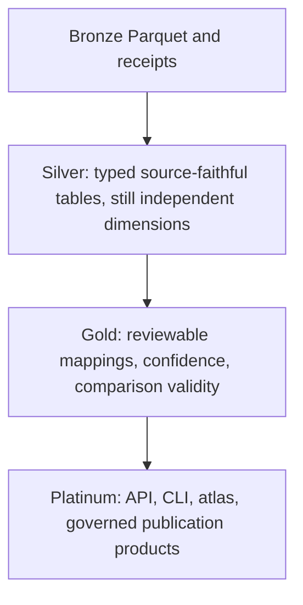

Silver may normalize names, units, and identifiers while retaining every
source-native key. Gold may emit cross-jurisdiction mapping candidates with
M-090 validity states. Platinum may serve comparison products. None of those
behaviours are in the bronze-completion track.

Actual Iceberg REST and Iceberg v3 interoperability, DuckLake, lakeFS-style
workflows, cryptographic batch or Merkle attestations, and Delta/Hudi
comparisons remain non-blocking experiments. Graph, vector, OMOP, semantic
normalization, and Rust terminology capabilities consume Bronze or Silver
outputs later and are not Bronze qualification evidence.
