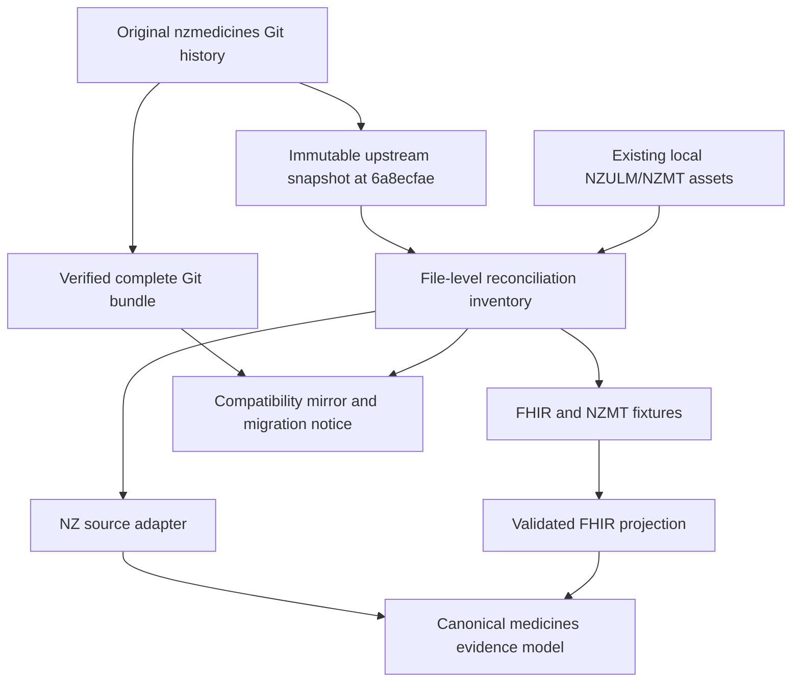
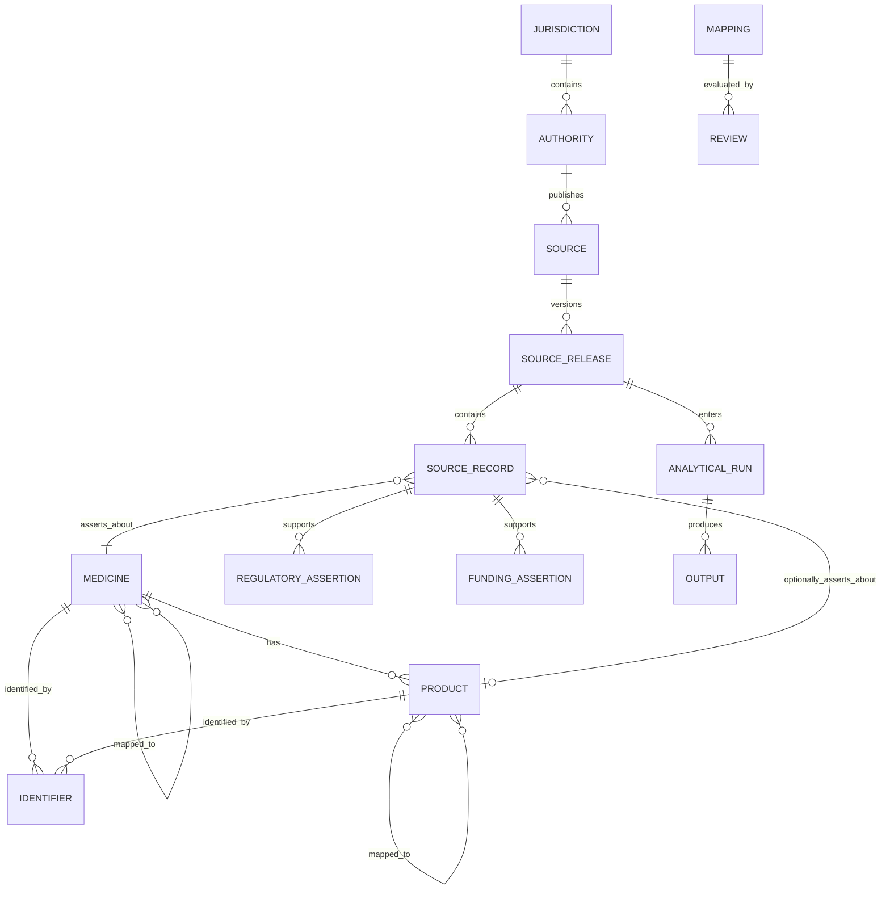
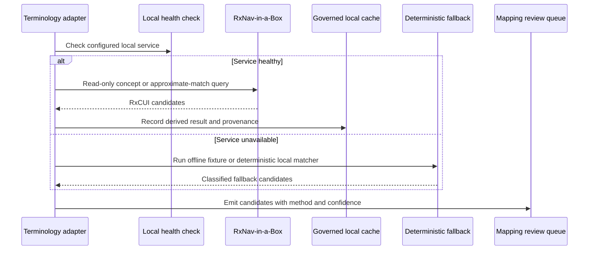
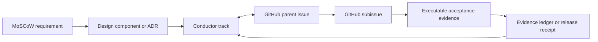

# System Design

## Architectural Position

The local workspace is the canonical global monorepository. `nzmedicines` becomes a preserved upstream history, NZULM/NZMT FHIR adapter, and fixture source. Portable canonical data remains separate from source-native FHIR projections and derived search indexes.

```mermaid
flowchart LR
    subgraph Sources["Jurisdiction source systems"]
        NZ["NZULM/NZMT, Medsafe, PHARMAC, NZF"]
        AU["TGA and PBS"]
        US["FDA, CMS and RxNorm/RxNav"]
        GL["Additional regulators and funders"]
    end

    subgraph Acquisition["Governed acquisition"]
        REG["Source and licence registry"]
        ADP["Versioned source adapters"]
        SNAP["Immutable source snapshots"]
    end

    subgraph Canonical["Canonical evidence core"]
        MED["Medicine and product identities"]
        ASSERT["Regulatory and funding assertions"]
        MAP["Cross-jurisdiction mappings"]
        PROV["Provenance, coverage and uncertainty"]
    end

    subgraph Engines["Execution and storage"]
        MOJO["Mojo kernels"]
        PY["Python 3.14 reference fallback"]
        POLARS["Polars and Arrow"]
        PARQUET["Parquet"]
        DUCK["DuckDB"]
        LANCE["LanceDB derived index"]
        LEX["Optional Tantivy lexical index"]
    end

    subgraph Products["Reviewed outputs"]
        CLI["CLI and read-only API"]
        ATLAS["Global comparison atlas"]
        HF["Hugging Face dataset and Space"]
        RELEASE["Signed release packages"]
    end

    Sources --> REG
    REG --> ADP
    ADP --> SNAP
    SNAP --> MED
    SNAP --> ASSERT
    MED --> MAP
    ASSERT --> PROV
    MAP --> PROV
    MED --> POLARS
    ASSERT --> POLARS
    MOJO <--> PY
    MOJO --> POLARS
    PY --> POLARS
    POLARS --> PARQUET
    PARQUET --> DUCK
    PARQUET --> LANCE
    PARQUET --> LEX
    DUCK --> CLI
    LANCE --> CLI
    LEX --> CLI
    CLI --> ATLAS
    PROV --> HF
    PROV --> RELEASE
```

## NZ Adapter and Migration Boundary

The upstream snapshot is evidence, not the editable implementation surface. Adapted code and schemas live in first-party package paths; retained upstream resources remain traceable to their original commit and file.

## Medicine Evidence Model

## RxNav-in-a-Box Boundary

## Work Traceability

## Deployment Boundary

- Windows development uses Python directly and Mojo through WSL.
- Linux CI is authoritative for Mojo.
- DuckDB, LanceDB, and optional lexical indexes are regenerable from portable governed artifacts.
- Public datasets contain only reviewed redistributable material.
- Credentials, restricted terminology payloads, and local source caches remain outside Git.
