# System Design

## Architectural Position

The local workspace is the canonical global monorepository. `nzmedicines` becomes a preserved upstream history, NZULM/NZMT FHIR adapter, and fixture source. Portable canonical data remains separate from source-native FHIR projections and derived search indexes.

```mermaid
flowchart LR
    subgraph Sources["Jurisdiction source systems"]
        NZ["NZULM/NZMT, Medsafe, PHARMAC, NZF"]
        AU["TGA and PBS"]
        US["FDA, CMS and RxNorm/RxNav"]
        GL["Additional regulators and funders"]
    end

    subgraph Acquisition["Governed acquisition"]
        REG["Source and licence registry"]
        ADP["Versioned source adapters"]
        SNAP["Immutable source snapshots"]
    end

    subgraph Canonical["Canonical evidence core"]
        MED["Medicine and product identities"]
        ASSERT["Regulatory and funding assertions"]
        MAP["Cross-jurisdiction mappings"]
        PROV["Provenance, coverage and uncertainty"]
    end

    subgraph Engines["Execution and storage"]
        MOJO["Mojo kernels"]
        PY["Python 3.14 reference fallback"]
        POLARS["Polars and Arrow"]
        PARQUET["Parquet"]
        DUCK["DuckDB"]
        LANCE["LanceDB derived index"]
        LEX["Optional Tantivy lexical index"]
    end

    subgraph Products["Reviewed outputs"]
        CLI["CLI and read-only API"]
        ATLAS["Global comparison atlas"]
        HF["Hugging Face dataset and Space"]
        RELEASE["Signed release packages"]
    end

    Sources --> REG
    REG --> ADP
    ADP --> SNAP
    SNAP --> MED
    SNAP --> ASSERT
    MED --> MAP
    ASSERT --> PROV
    MAP --> PROV
    MED --> POLARS
    ASSERT --> POLARS
    MOJO <--> PY
    MOJO --> POLARS
    PY --> POLARS
    POLARS --> PARQUET
    PARQUET --> DUCK
    PARQUET --> LANCE
    PARQUET --> LEX
    DUCK --> CLI
    LANCE --> CLI
    LEX --> CLI
    CLI --> ATLAS
    PROV --> HF
    PROV --> RELEASE
```

## NZ Adapter and Migration Boundary

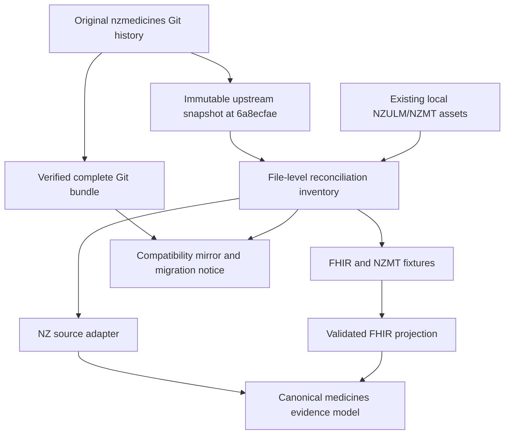

The upstream snapshot is evidence, not the editable implementation surface. Adapted code and schemas live in first-party package paths; retained upstream resources remain traceable to their original commit and file.

## Medicine Evidence Model

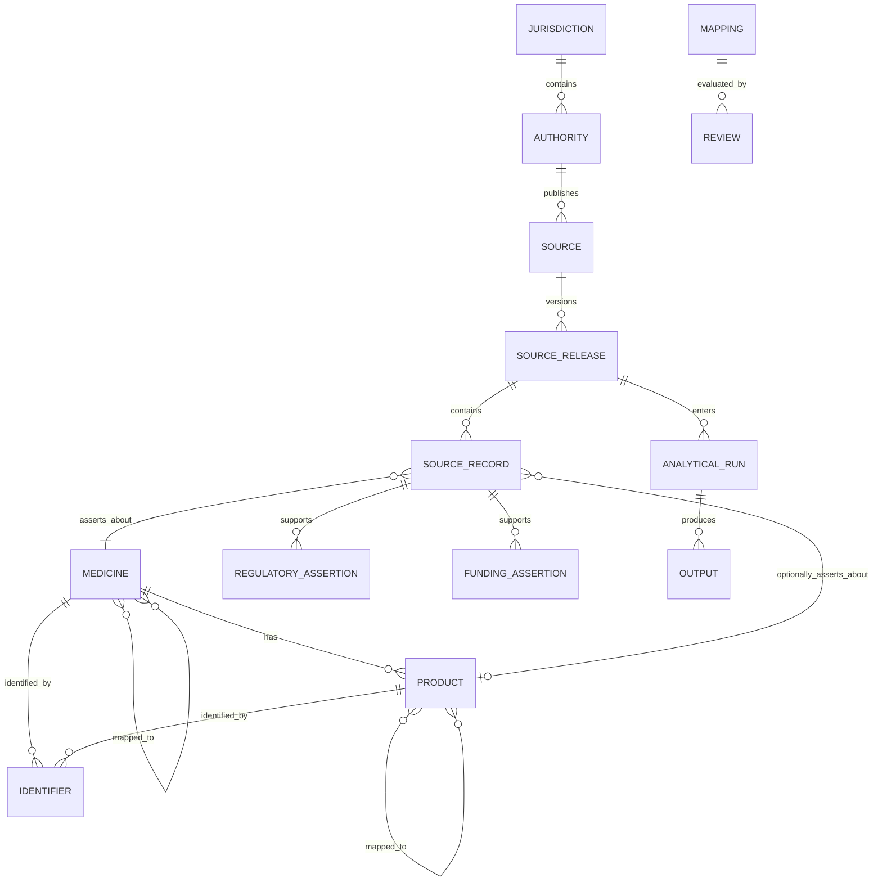

## RxNav-in-a-Box Boundary

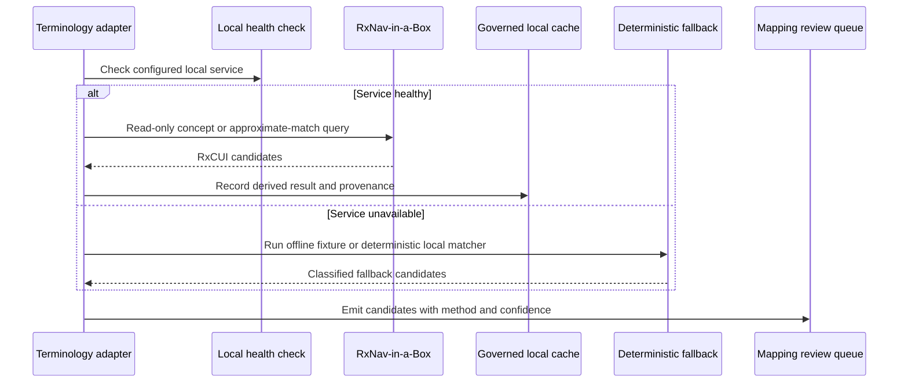

## Work Traceability

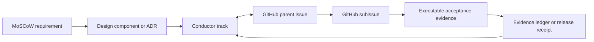

## Deployment Boundary

- Windows development uses Python directly and Mojo through WSL.
- Linux CI is authoritative for Mojo.
- DuckDB, LanceDB, and optional lexical indexes are regenerable from portable governed artifacts.
- Public datasets contain only reviewed redistributable material.
- Credentials, restricted terminology payloads, and local source caches remain outside Git.

## Single-Maintainer Context Control Plane

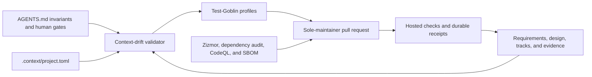

Automation supplies independent evidence, not a fictional independent
reviewer. Credentials, licensing, publication, release, archival, and
consequential-interpretation decisions remain explicit maintainer gates.

## Version and Maturity Control Plane

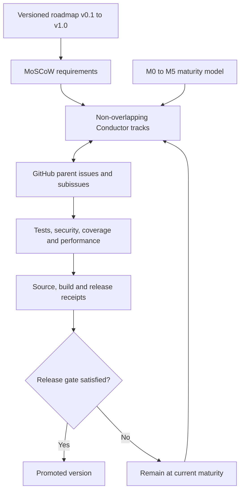

## Product Delivery and Hardening

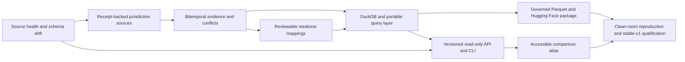

## Source Information and Adapter Capability Contract

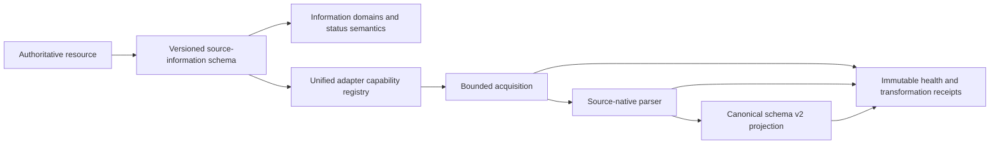

Each catalog entry labels the entities and information it actually contains.
Regulatory status, funding eligibility, prices, terminology relationships and
safety information remain distinct domains. Capability declarations distinguish
synthetic fixtures from live acquisition and production qualification.

## Canonical Discovery and Consumer Boundary

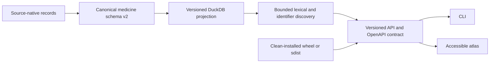

Discovery returns native and canonical identifiers, match method, provenance
and jurisdiction scope. SQL keyset pagination and database schema metadata keep
large queries bounded and migration-aware.

## Comparison Validity Boundary

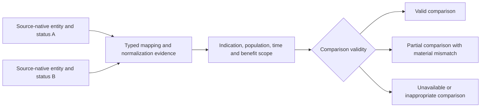

Comparison validity is an explicit output, not an inference from name or
terminology similarity. The system retains source-native legal and funding
meanings and must not imply therapeutic equivalence, substitutability or equal
benefit when entity, indication, population, temporal or benefit-design scopes
do not support that conclusion.

## Governed Research and Dataset Identity

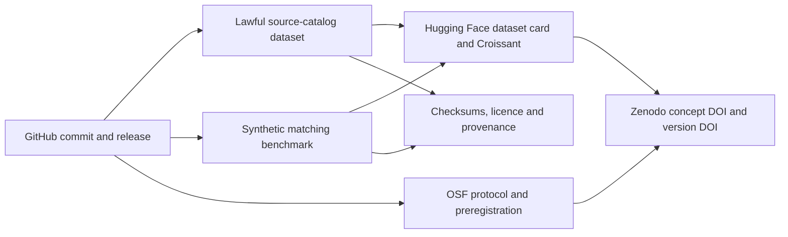

The source catalog and lawful synthetic benchmark are separate products with
separate licences and identifiers. Rights-restricted medicine payloads remain
outside public publication packages. Creating external records or publishing a
release remains an explicit maintainer gate.

The Phase 1 research contract is the machine-readable
`research/protocol/academic-protocol-v1.json`, validated by
`schemas/academic-protocol-v1.json` and rendered offline to
`docs/research/academic-protocol.md`. It binds the governed source catalog and
M-090 comparison-validity vocabulary to the protocol/methods work in GitHub
[#67](https://github.com/edithatogo/global-medicines-atlas/issues/67).

The Phase 3 OSF rehearsal is generated from
`research/preregistration/osf-preregistration-v1.json` into a committed,
checksum-addressed submission directory. The builder performs no network or
platform action; the validator fails closed unless submission remains offline
and maintainer review remains incomplete. Protocol, analysis plan, amendment
history, deviation register, citations, and data-management and ethics
statements are separate attachments so their identities remain auditable.

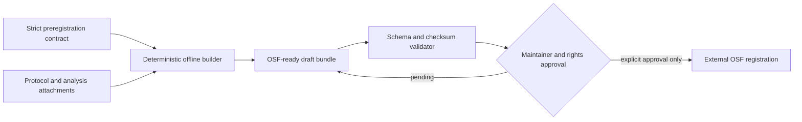

## Untrusted Acquisition and Failure Containment

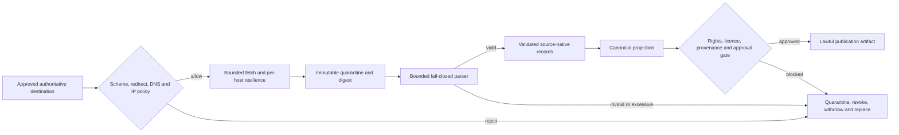

Acquired bytes are untrusted even when an authority is official. Logs retain
source IDs, digests and bounded outcomes but redact credentials, query strings
and source payloads. Compromise recovery covers upstream data, signing
provenance, credentials and already-published datasets.
