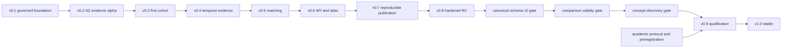

# Versioned Roadmap to Stable v1

Progress is evidence-gated. A version is complete only when its release gates
have durable receipts; calendar dates are planning signals, not completion
claims.

GitHub programme issue: [#44](https://github.com/edithatogo/global-medicines-atlas/issues/44).
Its native subissues are the Conductor delivery tracks; each track parent owns
its phase subissues.

| Version | Product outcome | Principal features | Conductor track |
|---|---|---|---|
| v0.1 Foundation | Governed monorepository | Python 3.14, Mojo canary, Test-Goblin, protected CI, source registry | `nzmedicines_migration_20260727` |
| v0.2 NZ evidence alpha | Traceable NZ comparison slice | Preserved NZULM/NZMT FHIR fixtures, Medsafe/PHARMAC separation, RxNorm fallback | `nzmedicines_migration_20260727` |
| v0.3 First-cohort alpha | Repeatable jurisdiction onboarding | NZL, AUS, USA, GBR, CAN, JPN and EU source contracts and receipt-backed ingestors | `global_country_adapters_20260729` |
| v0.4 Evidence beta | Historical, conflict-aware canonical evidence | Bitemporal assertions, immutable snapshots, conflicts, coverage denominators | `canonical_temporal_evidence_20260729` |
| v0.5 Matching beta | Reviewable cross-country equivalence candidates | Ingredient/product mappings, confidence, deterministic and semantic retrieval, adjudication | `cross_jurisdiction_matching_20260729` |
| v0.6 Product beta | Usable comparison service | Read-only API, CLI queries, atlas, accessibility, provenance drill-down | `comparison_api_atlas_20260729` |
| v0.7 Reproducible release beta | Governed public research outputs | Parquet, Croissant, data cards, citations, SBOM and attestations, dry-run publication | `governed_publication_20260729` |
| v0.8 Hardened RC | Secure and observable operations | Source information schema, unified adapter capabilities, source health, complete test inventory, mutation/performance budgets, recovery and compatibility canaries | `operational_hardening_20260729` |
| v0.9 Stable candidate | Independently reproducible, usable release candidate | Canonical medicine schema v2, comparison-validity semantics, concept discovery/catalog APIs, clean consumer installs, OpenAPI compatibility, documentation and an OSF-ready protocol | `stable_v1_qualification_20260729`, `academic_protocol_preregistration_20260729` |
| v1.0 Stable | Mature, supportable global medicines atlas | All blocking requirements evidenced, measured coverage, signed release, explicit residual limitations and reproducible research governance | `stable_v1_qualification_20260729`, `academic_protocol_preregistration_20260729` |

## Release gates

Every gate requires:

- requirement-to-test-to-receipt traceability;
- regulatory and funding assertions remaining distinct;
- measured source, jurisdiction, record and temporal coverage;
- provenance, rights and uncertainty validation;
- all protected GitHub checks passing;
- reproducible artifacts and recovery instructions;
- explicit human approval for licensing, publication and consequential claims.

## Feature maturity

Features advance through six levels:

1. **M0 Proposed** — requirement and authority identified.
2. **M1 Contracted** — schema, source contract and acceptance tests specified.
3. **M2 Implemented** — fixture-backed reference path passes.
4. **M3 Integrated** — end-to-end path and cross-component evidence pass.
5. **M4 Qualified** — live-source receipts, drift controls and performance evidence pass.
6. **M5 Stable** — independently reproduced, documented, supportable and release-approved.

The machine-readable mapping is [`maturity-model.json`](maturity-model.json).
