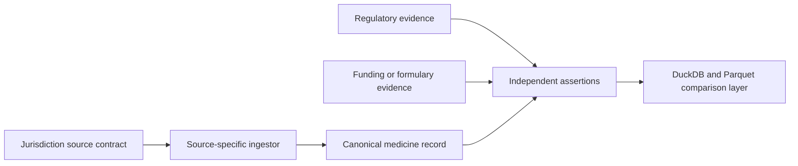

# Global Country-Adapter Framework

## Objective

Create a globally extensible adapter framework that compares medicines using
independent regulatory, funding, formulary, and terminology evidence.

## Must

- Use stable jurisdiction codes and versioned source contracts.
- Require at least one regulatory source before registering an adapter.
- Keep source declaration, ingestion coverage, and assertion evidence distinct.
- Onboard NZL, AUS, USA, GBR, CAN, JPN, and EU as the first representative
  cohort.
- Maintain a governed source catalog covering APIs, bulk downloads, searchable
  registers, and licensed feeds.
- Record update cadence, rights review, implementation readiness, and the
  evidentiary limit of every source.
- Never treat terminology equivalence, source declaration, or missing funding
  data as approval or reimbursement evidence.

## Should

- Reuse one canonical medicine/assertion model across adapters.
- Add ingestors only with fixtures, provenance, source receipts, and licensing
  disposition.
- Quantify jurisdiction, source, record, assertion, and temporal coverage.
- Expand the census through WHO-listed and WHO-benchmarked regulatory
  authorities, then pair each jurisdiction with national reimbursement/HTA
  sources where they exist.

## Won't in this slice

- Claim complete national or global coverage.
- Infer approval or funding from a product name match.
- Hydrate or publish restricted datasets.

## Design

