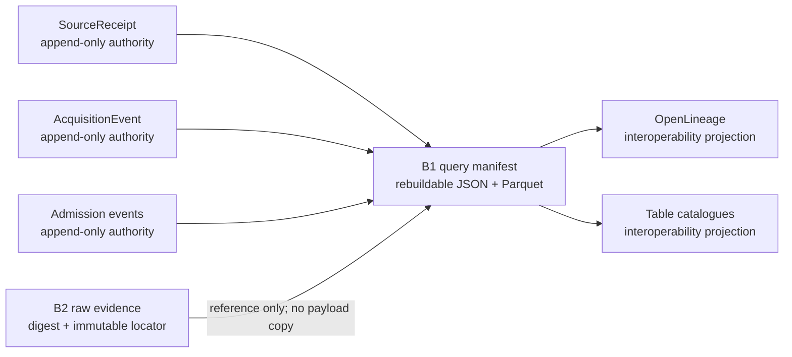

# B1 Acquisition Metadata

See the companion [B2 Raw Evidence contract](bronze-raw-evidence.md) for the
immutable object/reference boundary. B1 contains acquisition metadata and raw
object references only; optional source-native records are separate
rebuildable projections.

B1 is the append-only acquisition-metadata stratum inside Bronze. The native
`SourceReceipt`, `AcquisitionEvent`, and admission-event history are the
authority for what was retrieved, when it was retrieved, its temporal and
rights identity, its reuse decision, and whether it was admitted. Existing
receipt digests and acquisition identifiers remain unchanged.

The `b1-acquisition-metadata-manifest-v1` acquisition manifest schema is a
query contract over those records. Its JSON and Parquet forms are deterministic,
rebuildable projections
with exactly one row per acquisition event. OpenLineage and table-catalogue
entries are further interoperability projections. None supersedes the native
receipt or event history.



The manifest preserves the distinction between an acquisition event and its
content identity. Repeated retrievals of identical bytes therefore remain
separate rows with separate acquisition IDs and the same content digest.
Source-native dates remain absent when the source did not supply them. Original
and final retrieval locations are projected only after user information and
sensitive query values are redacted.

Rebuild a local manifest from a governed Bronze root without reading payload
contents:

```console
uv run python scripts/build_bronze_acquisition_metadata.py \
  --bronze-root build/bronze \
  --json-output build/b1-acquisition-metadata.json \
  --parquet-output build/b1-acquisition-metadata.parquet
```

The schema is committed at
`schemas/b1-acquisition-metadata-manifest-v1.json`. A missing receipt,
acquisition event, storage reference, or valid admission history makes
reconstruction fail closed. The output is metadata only: raw source payload
contents are never copied into the manifest.
