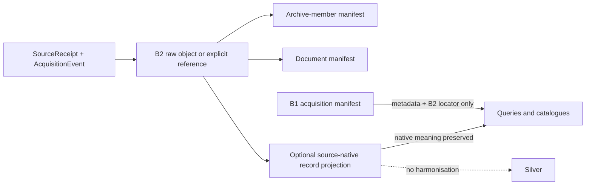

# B2 Raw Evidence

B2 is the Bronze stratum that preserves the source-native object itself. When
the rights and retention decision permits it, the object is stored byte-for-
byte under the existing content-addressed payload store and is bound to the
existing receipt digest and content ID. A B2 row records the immutable locator;
it never embeds payload contents.

When bytes cannot lawfully be retained, B2 records `external_reference_only`
with the official immutable reference. A rights or safety blocker records
`blocked` with a reason. Neither state invents a payload or a digest for bytes
that were not retained. B1 continues to hold acquisition metadata and points
to B2; its query manifest is not a replacement for either native receipt.

ZIP/tar files remain intact raw archives. Member manifests are byte-level
inventories and do not replace the archive. PDF, HTML, and opaque binary
objects receive byte-level document identities; text extraction and semantic
interpretation are derived processing. Binary members cannot be decoded with
replacement characters into a supposed `native_record`.

The optional `source_records.parquet` product is emitted only by an explicit
adapter that preserves source record granularity, native columns, and a stable
parser identity. It is a rebuildable Bronze projection, separate from the B1
acquisition manifest. Cross-source typing, harmonisation, and medicine
matching remain Silver or later.

The B2 manifest is deterministic and append-only. Deleting Parquet, Iceberg,
OpenLineage, or catalogue outputs does not delete or rewrite B2 bytes, native
receipts, or acquisition identity; those projections are regenerated from the
retained object and its receipt.
