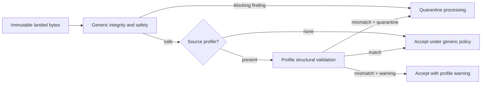

# Source-profile-aware Bronze admission

Bronze admission is deliberately split into two checks:

1. Generic integrity and safety inspection checks digests, lengths, hostile
   names, parser safety, archive limits, and replay/mutation signals.
2. An optional versioned `BronzeAdmissionProfile` checks only the source-native
   shape declared by the canonical source catalogue or an adapter contract.

An unprofiled source uses a conservative generic policy. JSON objects and
arrays are both valid top-level containers; JSON Lines is valid when every
non-empty line is an object or array. Landing a source does not claim coverage,
qualification, or currency.

Profiles can declare media, JSON container shapes, CSV delimiter/encoding and
headers, XML root/namespace, archive member patterns and resource ceilings.
Mismatch is either quarantined or recorded as a warning according to the
profile. In both cases landed bytes, receipts, acquisition identity, and
reviewer state remain unchanged. Quarantine only blocks downstream processing.

Profiles are contracts, not parsers. Source-native parsers remain responsible
for preserving native record granularity and columns; Silver harmonisation is
not performed by admission.
