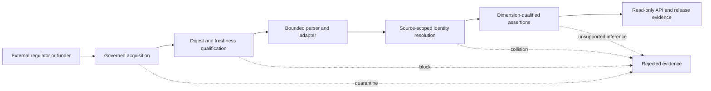

# Medicine-data integrity threat model

This threat model covers source acquisition, snapshot qualification, identity
resolution, and status publication. Its protected asset is an evidence-backed
claim about a medicine in a jurisdiction. Availability alone is insufficient:
the claim must retain source, time, identifier scope, and regulatory, funding,
or formulary dimension.

## Trust boundaries

External hosts, payloads, archive metadata, timestamps, and identifiers are
untrusted. Catalog metadata and committed digests are trusted only when bound
to reviewed repository history. A successful HTTP response proves neither
authority nor medicine status.

## Adversaries and failure modes

| Threat | Abuse or failure | Required control | Safe result |
|---|---|---|---|
| Poisoned download | A compromised mirror, cache, proxy, or upstream returns altered bytes | Compare payload SHA-256 with trusted metadata before parsing | Quarantine |
| Stale snapshot | An old or future-dated extract is presented as current | Enforce an explicit maximum age at promotion time | Block current-state use |
| Identifier collision | Equal local values from different authorities are merged | Scope identifiers by jurisdiction, source, and system; surface cross-concept collisions | Block automatic merge |
| False status inference | Funding, formulary, inferred, or HTA evidence is presented as regulatory approval, or vice versa | Require matching assertion dimension and confirmed evidence | Block assertion |

The controls are exercised by
`python scripts/run_data_integrity_exercises.py`. The command emits a
machine-readable receipt only when all four adversarial cases fail closed.
The receipt is qualification evidence for the controls, not evidence that an
external source is complete, current, authoritative, or legally reusable.

## Residual risks

- A trusted digest can bind malicious bytes if its approval process is
  compromised; reviewed source metadata and provenance remain necessary.
- Freshness limits vary by source and do not prove that an authority has
  published every change.
- Crosswalks can contain clinically plausible but incorrect links; ambiguous
  matches require review and must preserve original identifiers.
- Authority semantics differ by jurisdiction. Adapter-specific mappings and
  source evidence limits remain authoritative over generic labels.
- The exercise uses deterministic hostile fixtures. Live-source qualification,
  rights review, and release approval remain separate gated activities.
